## mODIL (multiresolution ODIL) Optimizing a Discrete Loss

> [[arXiv:2303.04679]](https://arxiv.org/abs/2303.04679)

## Multigrid Decomposition

  * Idea to [speed up the convergence of optimizers]{.color5} (L-BFGS, Adam, etc)
  * Use a hierarchy of grids, e.g. $N_1=65,\; N_2=33, \dots, N_L=3$
  * Decompose the solution $u$ on the fine grid $N_1$ as
    $$
    u = M_L(u_1, u_2, \dots, u_L) = u_1 + T_1 u_2 + T_1 T_2 u_3 + \dots + T_1\dots T_{L-1} u_L
    $$
    where $T_i$ is an interpolation operator from grid $N_{i+1}$ to $N_{i}$
  * Instead of minimizing the loss $$L(u) \rightarrow \min$$
    minimize $$L(M_L(u_1, u_2, \dots)) \rightarrow \min$$

## Multigrid Decomposition

  

  

  * Cavity 2D
  * L-BFGS
  * $\mathrm{Re}=100$
  * grid $65\times 65$
  * [10x speedup]{.color5} with 5 levels  
    (65, 33, 17, 9, 5)
  

  

  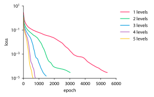</img>
  

  

  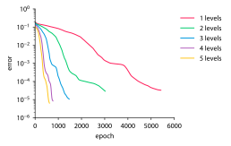</img>
  

  

## Multigrid Decomposition

  

  

  * Cavity 2D
  * L-BFGS
  * $\mathrm{Re}=400$
  * grid $65\times 65$
  * [10x speedup]{.color5} with 5 levels  
    (65, 33, 17, 9, 5)
  

  

  </img>
  

  

  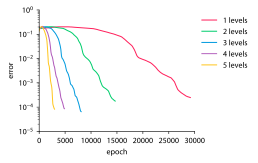</img>
  

  

## Multigrid Decomposition

  

  

  * Poisson 1D
  * Adam
  * grid $65$
  

  

  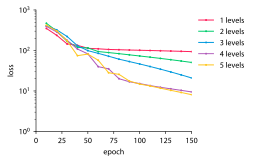</img>
  

  

  </img>
  

  

## Optical Flow

* [Optical flow problem: velocity from tracer field]{.color5}

* Find a velocity field $\mathbf{u}(x,y,t)$ given that the tracer field $c(x,y,t)$  
  satisfies the advection equation
  $$\frac{\partial c}{\partial t} + \mathbf{u}\cdot\nabla{c} = 0$$
  and takes known initial $\left.c\right|_{t=0}=c_0$
  and final $\left.c\right|_{t=1}=c_1$ values

* The loss function is a discretization of
  $$\begin{align*}
  L(c,\mathbf{u})&\textstyle=
    \int\big(\frac{\partial c}{\partial t}+\mathbf{u}\cdot\nabla{c}\big)^2
    {\rm d}x {\rm d}y {\rm d}t
    +\int(\left.c\right|_{t=0}-c_0)^2 {\rm d}x {\rm d}y
    +\int(\left.c\right|_{t=1}-c_1)^2 {\rm d}x {\rm d}y
    \\
    &\textstyle
    +\int|k_\mathrm{xreg}\nabla^2 \mathbf{u}|^2{\rm d}x{\rm d}y {\rm d}t
    +\int|k_\mathrm{treg}\frac{\partial}{\partial t} \mathbf{u}|^2{\rm d}x{\rm d}y {\rm d}t
    \end{align*}
  $$

* Grid of $65\times 65\times 65$ points

## Optical Flow <a id='123' onclick="pause_all(this, 2, 0.25)" style="cursor: pointer;">&#x23ef;</a> <a id='123' onclick="stop_all(this)" style="cursor: pointer;">&#x23f9;</a>

  

  

  * Adam, grid $N=129$, 7 levels
    - runtime 360 ms / epoch (GPU)
    - runtime 1000 ms / epoch (CPU)
    - 500 epochs
  

  

  <video height="150px" data-autoplay loop>
  <source data-src="media/mgopt/adv2d/nx129_lvl7/u.webm" type="video/webm">
  </video>
  

  

  

  

  * Adam, grid $N=257$, 7 levels
    - runtime 550 ms / epoch (GPU)
    - runtime 14 000 ms / epoch (CPU)
    - 500 epochs
  

  

  <video height="150px" data-autoplay loop>
  <source data-src="media/mgopt/adv2d/nx257_lvl7/u.webm" type="video/webm">
  </video>
  

  

  

  

  * Adam, grid $N=257$, 5 levels
    - runtime 480 ms / epoch (GPU)
    - 500 epochs
  

  

  <video height="150px" data-autoplay loop>
  <source data-src="media/mgopt/adv2d/nx257_lvl5/u.webm" type="video/webm">
  </video>
  

  

## Optical Flow

  

  

  * Optical flow
  * Adam
  

  

  </img>
  

  

  </img>
  

  

## Body Shape Inference

* [Inferring body shape from velocity measurements]{.color5}

* Find a body fraction field $\chi(\mathbf{x})$ given that the velocity field $\mathbf{u}(\mathbf{x})$  
  satisfies the Navier-Stokes equations with penalization
  $$\begin{aligned}
  \nabla \cdot \mathbf{u} &= 0 \\ 
  (\mathbf{u}\cdot\nabla)\mathbf{u} &= -\nabla p + \frac{D}{\mathrm{Re}}\nabla^2\mathbf{u} - \lambda\chi\mathbf{u}
  \end{aligned}$$
  and takes known values $\mathbf{u}(\mathbf{x}_i)=\mathbf{u}_i$  
  in the measurement points $\mathbf{x}_i$ for $i=1,\dots,N$

* Transform $\chi = 1 / (1 + e^{-\hat\chi+5})$

## Body Shape Inference

* Penalization as mixture
  $$(1-\chi)\big((\mathbf{u}\cdot\nabla)\mathbf{u} +\nabla p - \nu\nabla^2\mathbf{u}\big) + \lambda\chi\mathbf{u} = 0$$
  with $\lambda=1$

* Properties:
  - exact $\mathbf{u}=0$ inside the body
  - small $\chi>0$ does not cause large force

## Body Shape Inference <a id='123' onclick="pause_all(this, 2)" style="cursor: pointer;">&#x23ef;</a> <a id='123' onclick="stop_all(this)" style="cursor: pointer;">&#x23f9;</a>

  

  

  * Circle 2D, $\mathrm{Re}=60$
  * grid $129\times 65$
  * L-BFGS, 25000 epochs
  * runtime 30 min (CPU)
  

  

    </img>
    </img>
    <small>reference</small>
  

  

    <video height="110px" poster=media/mgopt/body2db/circle/bfgs/chi.png>
    <source data-src="media/mgopt/body2db/circle/bfgs/chi.webm" type="video/webm">
    </video>
    <video height="110px" poster=media/mgopt/body2db/circle/bfgs/omega.png>
    <source data-src="media/mgopt/body2db/circle/bfgs/omega.webm" type="video/webm">
    </video>
    <small>190 points</small>
  

  

  </img>
  </img>
  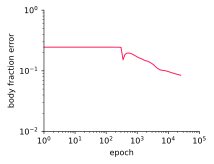</img>
  </img>

## Body Shape Inference <a id='123' onclick="pause_all(this, 2)" style="cursor: pointer;">&#x23ef;</a> <a id='123' onclick="stop_all(this)" style="cursor: pointer;">&#x23f9;</a>

  

  

  * Half-circle 2D, $\mathrm{Re}=60$
  * grid $129\times 65$
  * L-BFGS, 25000 epochs
  * runtime 30 min (CPU)
  

  

    </img>
    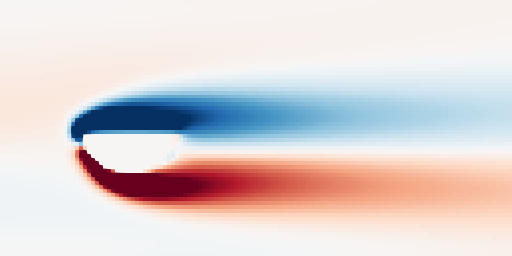</img>
    <small>reference</small>
  

  

    <video height="110px" poster=media/mgopt/body2db/half/bfgs/chi.png>
    <source data-src="media/mgopt/body2db/half/bfgs/chi.webm" type="video/webm">
    </video>
    <video height="110px" poster=media/mgopt/body2db/half/bfgs/omega.png>
    <source data-src="media/mgopt/body2db/half/bfgs/omega.webm" type="video/webm">
    </video>
    <small>190 points</small>
  

  

  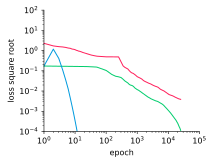</img>
  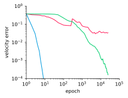</img>
  </img>
  </img>

## Body Shape Inference <a id='123' onclick="pause_all(this, 2)" style="cursor: pointer;">&#x23ef;</a> <a id='123' onclick="stop_all(this)" style="cursor: pointer;">&#x23f9;</a>

  

  

  * Sphere 3D, $\mathrm{Re}=60$
  * grid $129\times 65\times 65$
  * L-BFGS, $20\,000$ epochs
  * runtime 2 hours (GPU)
  

  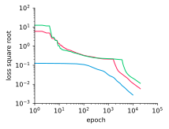</img>
  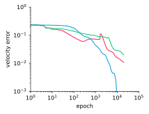</img>
  </img>
   </img>
  

  

  

  

    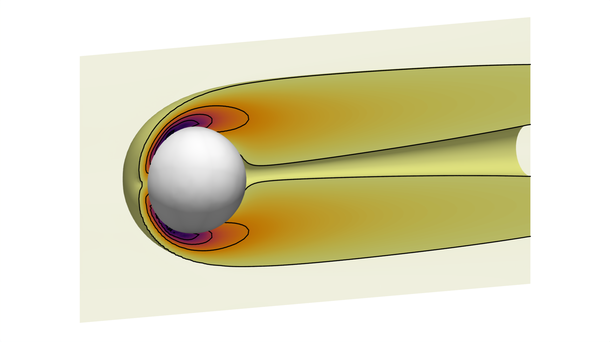</img>
     <small>reference</small>
  

  

    <video poster=media/mgopt/body3db/circle/bfgs_684/omega.png>
    <source data-src="media/mgopt/body3db/circle/bfgs_684/omega.webm" type="video/webm">
    </video>
     <small>684 points</small>
  

  

    <video poster=media/mgopt/body3db/circle/bfgs_171/omega.png>
    <source data-src="media/mgopt/body3db/circle/bfgs_171/omega.webm" type="video/webm">
    </video>
     <small>171 points</small>
  

  </img>
  

  

## Body Shape Inference <a id='123' onclick="pause_all(this, 2)" style="cursor: pointer;">&#x23ef;</a> <a id='123' onclick="stop_all(this)" style="cursor: pointer;">&#x23f9;</a>

  

  

  * Half-sphere 3D, $\mathrm{Re}=60$
  * grid $129\times 65\times 65$
  * L-BFGS, $20\,000$ epochs
  * runtime 2 hours (GPU)
  

  </img>
  </img>
  </img>
   </img>
  

  

  

  

    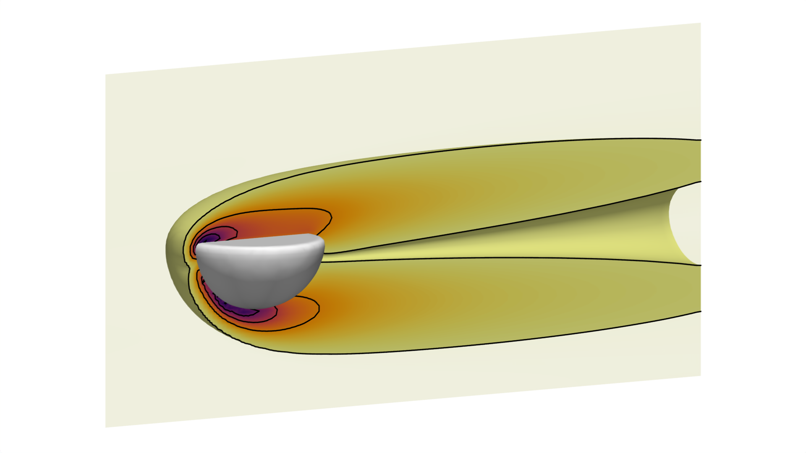</img>
     <small>reference</small>
  

  

    <video poster=media/mgopt/body3db/half/bfgs_684/omega.png>
    <source data-src="media/mgopt/body3db/half/bfgs_684/omega.webm" type="video/webm">
    </video>
     <small>684 points</small>
  

  

    <video poster=media/mgopt/body3db/half/bfgs_171/omega.png>
    <source data-src="media/mgopt/body3db/half/bfgs_171/omega.webm" type="video/webm">
    </video>
     <small>171 points</small>
  

  </img>
  

  

## Body Shape Inference

  

  

  * Sphere 3D, $\mathrm{Re}=60$
  * grid $257\times 129\times 129$
  * L-BFGS, $100\,000$ epochs
  * runtime 8 hours (GPU)
  

  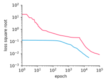</img>
  </img>
  </img>
   </img>
  

  

  

  

    </img>
     <small>reference</small>
  

  

    </img>
     <small>698 points</small>
  

  </img>
  

  

## Body Shape Inference

  

  

  * Sphere 3D, $\mathrm{Re}=60$
  * grid $257\times 129\times 129$
  * L-BFGS, $40\,000$ epochs
  * runtime 3 hours (GPU)
  

  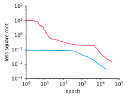</img>
  </img>
  </img>
   </img>
  

  

  

  

    </img>
     <small>reference</small>
  

  

    </img>
     <small>698 points</small>
  

  </img>
  

  

